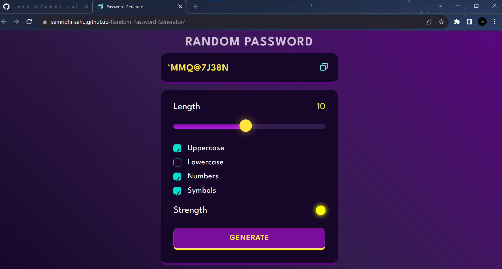

# Random Password Generator
Random Password Generator is a web application built using HTML, CSS, and JavaScript that generates strong and secure random passwords based on user-defined criteria.

# Features
Password Length: Users can choose the length of the password (between 8 to 128 characters).
Character Types: Users can select the character types to include in the password, such as uppercase letters, lowercase letters, numbers, and special characters.
Randomness: The application uses a cryptographically secure random number generator to ensure strong and unpredictable passwords.
Copy to Clipboard: Users can easily copy the generated password to the clipboard with a single click.

# Getting Started
To use the Random Password Generator, follow these steps:

Download or clone the repository: git clone https://github.com/samridhi-sahu/random-password-generator.git

Open the index.html file in your web browser.

Choose the desired password length using the slider.

Check the boxes for character types you want to include in the password.

Click the "Generate" button to get a random password that meets your criteria.

Click the "Copy to Clipboard" icon to copy the generated password to the clipboard for easy use.

# Technologies Used
HTML.
CSS.
JavaScript.

